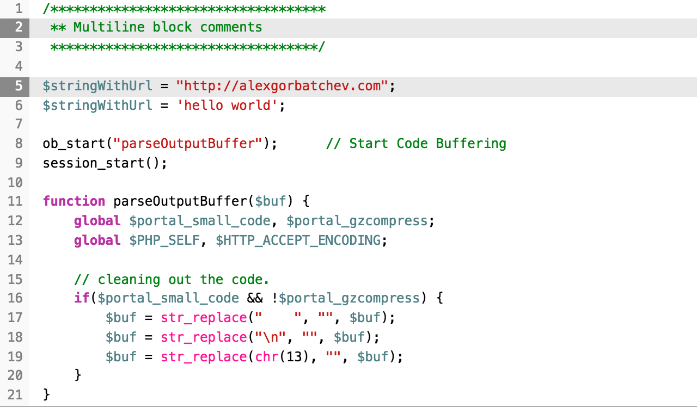

# theme-swift

Swift theme for [SyntaxHighlighter](https://github.com/syntaxhighlighter/syntaxhighlighter).

## Usage

Please see [Building Instructions](https://github.com/syntaxhighlighter/syntaxhighlighter/wiki/Building) on the [SyntaxHighlighter Wiki](https://github.com/syntaxhighlighter/syntaxhighlighter/wiki) for details.

## License

MIT
